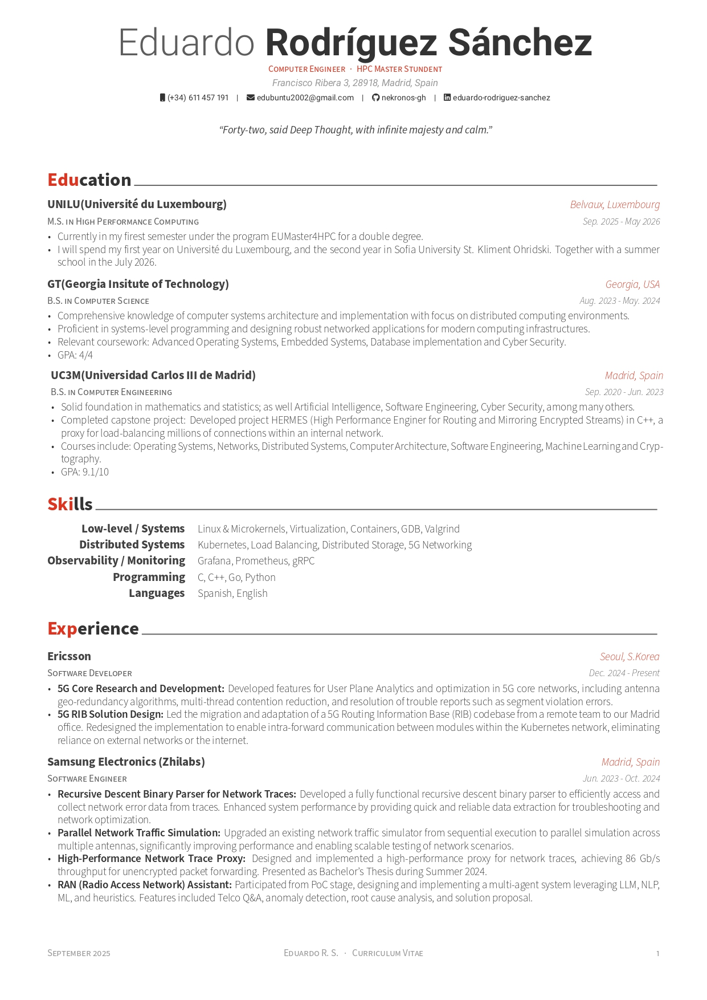

# CV

LaTeX CV (Awesome-CV template) in two variants:

| Variant | Source | Pages |
|---|---|---|
| Full | `src/cv-full.tex` + `src/sections/` | 2 |
| Condensed one-pager | `src/cv-onepage.tex` (self-contained) | 1 |

## Layout

```text
.
├── Makefile            # all/full/onepage/check/release/clean/distclean/help
├── cv.cls              # Awesome-CV class (shared)
├── src/
│   ├── cv-full.tex     # full CV, pulls sections below
│   ├── cv-onepage.tex  # condensed CV, self-contained
│   └── sections/       # per-section content for the full CV
├── build/              # `make` output (gitignored)
├── cv.pdf              # release copy of the full CV (tracked)
├── cv-onepage.pdf      # release copy of the one-pager (tracked)
└── imgs/               # preview images
```

## Build

Requires `xelatex`. `make check` additionally uses `pdfinfo`.

```sh
make            # build build/cv-full.pdf + build/cv-onepage.pdf
make full       # only the full CV
make onepage    # only the one-pager
make check      # build both + assert the one-pager is 1 page
make release    # build both + refresh ./cv.pdf and ./cv-onepage.pdf
make clean      # drop build/ and stray LaTeX byproducts
make help       # list targets
```

Override the engine/flags if needed: `make LATEX=lualatex LATEXFLAGS="-interaction=nonstopmode"`.

## Preview


